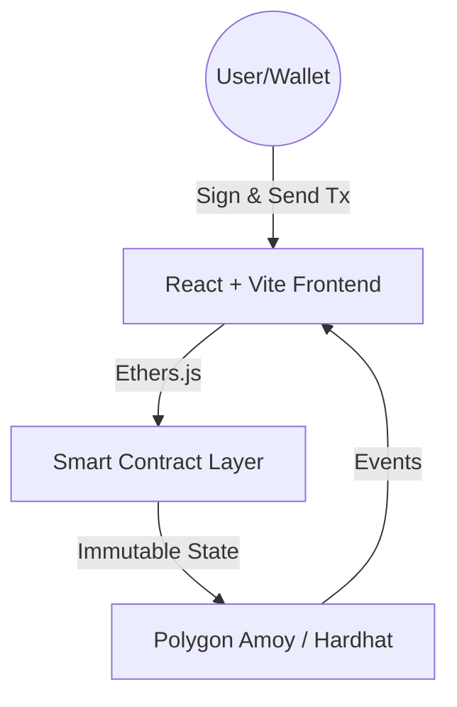

# 🚀 BlockFund — Decentralized Crowdfunding Platform

**BlockFund** is a blockchain-powered crowdfunding platform that eliminates trust issues in traditional fundraising. It uses smart contracts for fund custody, milestone-based governance, and automated refunds. Creators can raise funds transparently, while contributors gain full on-chain visibility and control over fund usage.

---

## 🌍 The Real-World Problem

Traditional crowdfunding platforms like Kickstarter and GoFundMe face critical limitations:

- ❌ **Blind Trust:** Donors must rely on campaign owners without verifiable guarantees.
- ❌ **Centralized Control:** Funds are managed by platforms, creating single points of failure.
- ❌ **Lack of Proof:** No on-chain evidence of how funds are actually spent.
- ❌ **Manual Refunds:** Refunds depend on platform discretion, leading to delays or denials.
- ❌ **Bias & Censorship:** Platforms can block or freeze campaigns based on internal policies.

---

## ✅ How BlockFund Solves It

BlockFund replaces **trust with code**, leveraging blockchain and smart contracts for:

- **Escrow-Locked Funds:** Donations are held securely on-chain until specific conditions are met.
- **Public Verifiability:** Every transaction is transparent and auditable via blockchain explorers.
- **Conditional Releases:** Funds unlock only upon community milestone approval.
- **Community Voting:** Contributors govern fund disbursement democratically.
- **Automated Refunds:** Instant returns if goals fail—no human intervention required.

---

## 🔑 Key Features

### 🔐 Web3 Authentication

- Wallet-based login via **MetaMask**.
- No passwords or centralized databases—your wallet address is your identity.

### 📢 Campaign Creation

- Creators define funding targets, deadlines, and specific **milestones** with detailed fund allocations.
- All data is stored immutably on-chain.

### 🗳️ Milestone-Based Governance

- Funds are released in stages (e.g., Prototype, Production).
- Creators submit proof of progress; **contributors vote** to approve or reject the next fund release.

### 🔁 Automatic Refund System

- **Full Refund:** Triggered if the funding target is not met by the deadline.
- **Pro-Rata Refund:** Partial returns if a specific milestone is rejected by the community.

---

## 🧑‍💼 Role-Based Access

| Role | Permissions |
|------|-------------|
| **Admin (Creator)** | Create campaigns, request milestone releases, update metadata. |
| **User (Contributor)** | Donate funds, vote on milestones, claim refunds, view analytics. |

---

## 🏗️ System Architecture



### Architectural Highlights:

- **Serverless Design:** No centralized backend—blockchain serves as both database and logic layer.
- **Direct Interaction:** Frontend communicates straight to contracts via `ethers.js`.
- **Fault-Tolerant:** Decentralized by default, resistant to downtime or censorship.
- **Scalable:** Built for high-volume campaigns with gas optimizations.

---

## ⚙️ Tech Stack

- **Frontend:** React, Vite, Tailwind CSS, Ethers.js
- **Blockchain:** Solidity, Hardhat Framework
- **Network:** Polygon Amoy Testnet (Local: Hardhat Network)
- **Storage:** On-chain (Core logic), IPFS (Media assets like images/videos)

---

## 📜 Smart Contract Capabilities

- **Escrow Logic:** Time-locked and condition-based custody.
- **Voting System:** Token-weighted or one-per-donor governance.
- **Security:** Reentrancy guards, access controls, and emergency pauses.
- **Efficiency:** Gas-optimized loops and storage patterns.
- **Contract:** `CrowdfundingPlatform.sol` – Designed with secure, audited patterns.

---

## 🔗 Deployment Details

- **Network:** Polygon Amoy Testnet
- **Contract Address:** `0xYourContractAddressHere`
- **Explorer:** [PolygonScan Amoy](https://amoy.polygonscan.com/)

---

## 🧪 Local Development Setup

### 1. Clone the Repository

```bash
git clone https://github.com/yourusername/blockfund.git
cd blockfund
```

### 2. Smart Contract Setup

```bash
cd web3
npm install
npx hardhat compile
npx hardhat node  # Keep this terminal running
```

*In a new terminal:*

```bash
npx hardhat run scripts/deploy.js --network localhost
```

### 3. Frontend Setup

```bash
cd ../client
npm install
npm run dev
```

Open: [http://localhost:5173](http://localhost:5173)

### 4. Wallet Configuration

- Install **MetaMask** browser extension.
- Add Hardhat network: `RPC URL: http://127.0.0.1:8545`, `Chain ID: 31337`.
- Import a test account private key from the Hardhat console to test locally.

---

## 🏆 Hackathon Value Proposition

- **Trust Revolution:** Tackles a massive market plagued by lack of accountability.
- **Governance Innovation:** Milestone voting empowers donors like never before.
- **Verifiable Impact:** Every action is on-chain and auditable by anyone.

---

## 🚀 Future Enhancements

- **NFT Rewards:** Exclusive donor badges or perks as soulbound tokens.
- **DAO Expansion:** Community governance for platform-wide decisions.
- **Multi-Chain:** Support for Arbitrum, Optimism, and Base.
- **Advanced Analytics:** Donor dashboards with AI-driven impact metrics.

---

## 📌 Conclusion

BlockFund isn't just a DApp—it's a paradigm shift. By embedding accountability into code, it rebuilds trust in crowdfunding, making fair funding accessible to all.

**Built with ❤️ for decentralized innovation.**